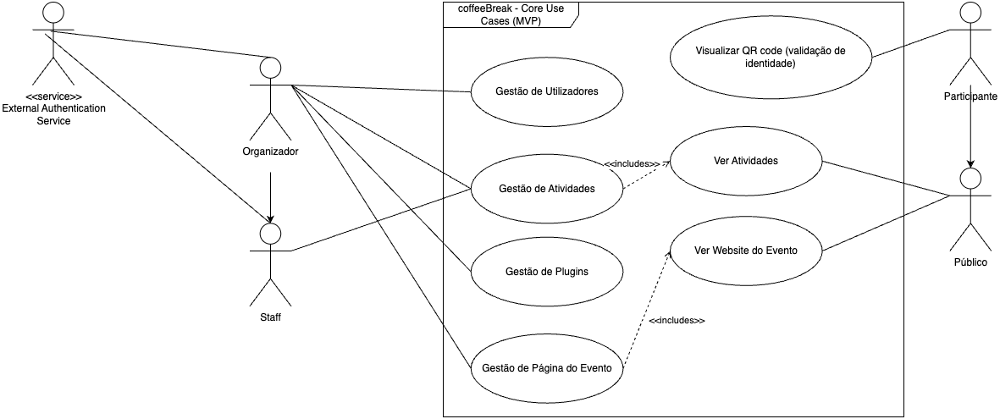
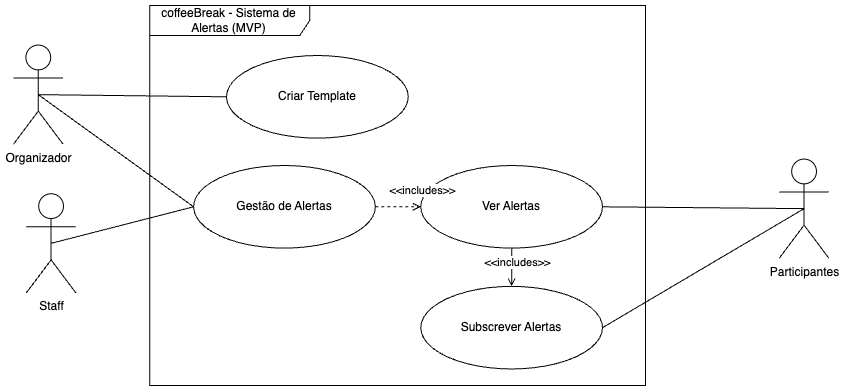
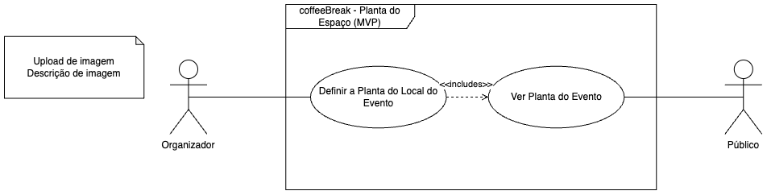
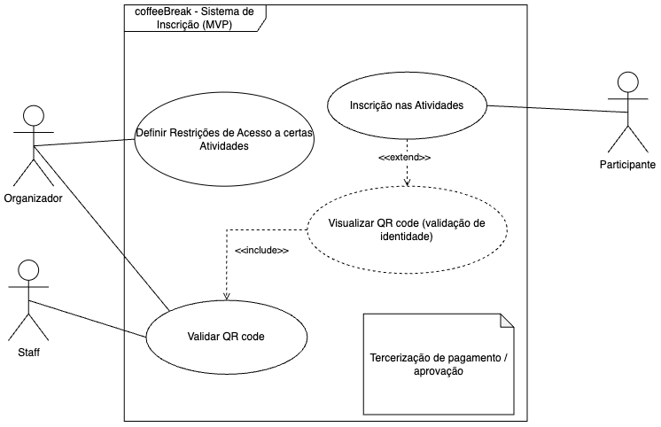
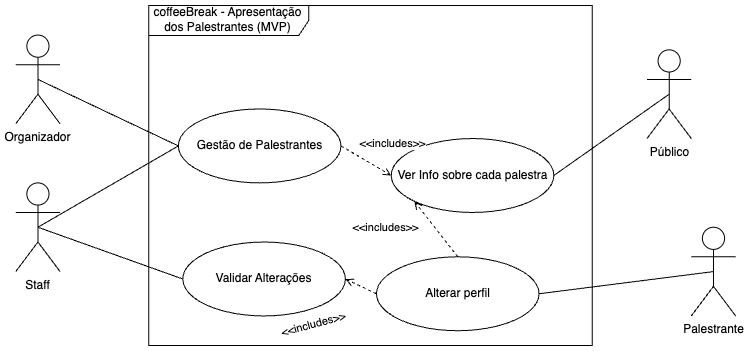
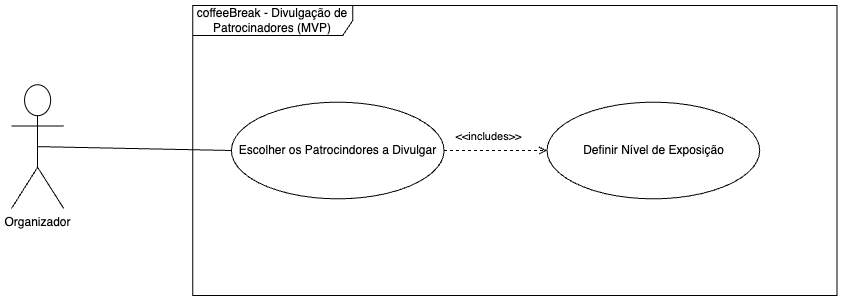

# M2 - Elaboration

  <iframe loading="lazy" style="position: absolute; width: 100%; height: 100%; top: 0; left: 0; border: none; padding: 0;margin: 0;"
    src="https://www.canva.com/design/DAGg-vAcoOk/3dUXHu0imF3g62kkPfGWsQ/view?embed" allowfullscreen="allowfullscreen" allow="fullscreen">
  </iframe>

## State-of-the-art

### Selected Features
These are the key features we identified in our market analysis.

#### Core Features
- **Features Selection**: Allows to (de)activate specific features
- **Activities Scheduling**: Allows the creation of the event program and exhibit it to attendees
- **Extensibility**: Integrate extra features through API's, plugins, etc.
- **Customized webpages**: Have customization features to create event specific webpages
- **Personal Schedule**: Allows attendees and speakers to view a partial schedule with only their activities

#### Communication & Social
- **Broadcast Notifications**: Allows staff to send announcements to attendees and others
- **Posts**: Allows Organizers/staff to publish posts that attendees can see
- **Attendees Chat**: Allows messaging between attendees
- **Discussion Topics**: Allows the creation of a chat related to a topic of the event (e.g. lecture, workshop, etc.)
- **Social feed**: Allows attendees and speakers to publish content (text, images, etc.)
- **Networking Suggestions**: Indicates people with the same interests in the event

#### Event Management
- **QR Code/e-badges**: Allows the use of QR Codes / e-badges to verify attendees identity, activity registration or gamification features
- **Schedule Meetings**: Allows attendees to schedule meetings with others
- **Gamification**: Allows the creation of challenges to increase engagement
- **Floor Plan**: Allows the visualization of the event enclosure
- **Live Q&A/Polls**: Allows the creation of Q&A sessions or polls during a speech
- **Online transmissions**: Allows the visualization of the event online

#### Business & Analytics
- **Sponsor disclosure**: Allows disclosure of sponsors
- **Sponsorship Tiers**: Allows to increase publicity for main sponsors
- **Event Stats**: Allows organizers to collect and visualize some statistics of the event
- **Reserve Seats**: Allows attendees to reserve seat in an activity with limited number of participants
- **Event feedback**: Allows the collection of event feedback through surveys or ratings

#### Contact Features
- **Attendees-Exhibitors Contact**: Allows attendees to chat with exhibitors
- **Attendees-Staff Contact**: Allows attendees to contact with staff
- **Exhibitors/Speakers-Staff Contact**: Allows exhibitors and speakers to contact staff

Based on our market analysis during the inception phase, we conducted a detailed comparison of how each platform implements the identified features.

### Core Features

| System | Features Selection | Activities Scheduling | Extensibility | Customized webpages | Personal Schedule |
|--------|:------------------:|:----------------------:|:---------------:|:-------------------:|:------------------:|
| CVENT | ✅ | ✅ | ❌ | ✅ | ✅ |
| Swapcard | ✅ | ✅ | 🟨 | ✅ | ✅ |
| Whova | ❌ | ✅ | ❌ | ✅ | ✅ |
| Bizzabo | ✅ | ✅ | ✅ | ✅ | ✅ |

### Communication & Social

| System | Broadcast Notifications | Posts | Attendees Chat | Discussion Topics | Social feed | Networking Suggestions |
|--------|:----------------------:|:-------:|:----------------:|:------------------:|:-------------:|:--------------------:|
| CVENT | ❌ | ✅ | ✅ | ✅ | ❌ | ✅ |
| Swapcard | ❌ | ✅ | ✅ | ✅ | ✅ | ✅ |
| Whova | ✅ | ❌ | ✅ | ✅ | ❌ | ✅ |
| Bizzabo | ✅ | ✅ | ✅ | ✅ | ✅ | ✅ |

### Event Management

| System | QR Code/e-badges | Schedule Meetings | Gamification | Floor Plan | Live Q&A/Polls | Online transmissions |
|--------|:---------------:|:------------------:|:--------------:|:------------:|:----------------:|:-------------------:|
| CVENT | ❌ | ✅ | ❌ | ✅ | ✅ | ✅ |
| Swapcard | ✅ | ✅ | ❌ | ✅ | ❌ | ✅ |
| Whova | ✅ | ✅ | ✅ | ✅ | ✅ | ✅ |
| Bizzabo | ✅ | ✅ | ✅ | ✅ | ✅ | ✅ |

### Business & Analytics

| System | Sponsor disclosure | Sponsorship Tiers | Event Stats | Reserve Seats | Event feedback |
|--------|:-------------------:|:-------------------:|:-------------:|:---------------:|:----------------:|
| CVENT | ✅ | ✅ | ✅ | ❌ | ✅ |
| Swapcard | ✅ | ✅ | ✅ | ✅ | ✅ |
| Whova | ✅ | ✅ | ✅ | ❌ | ✅ |
| Bizzabo | ✅ | ❌ | ✅ | ✅ | ✅ |

### Contact Features

| System | Attendees-Exhibitors Contact | Attendees-Staff Contact | Exhibitors/Speakers-Staff Contact  |
|--------|:----------------------------:|:------------------------:|:--------------------------------:|
| CVENT | ✅ | ✅ | ✅ |
| Swapcard | ❌ | ❌ | ✅ |
| Whova | ✅ | ❌ | ✅ |
| Bizzabo | ✅ | ✅ | ✅ |

Legend:
- ✅ Available
- ❌ Not Available
- 🟨 Partially Available

## Requirements

### Functional Requirements
All these requirements will be present in the Minimum Viable Product (MVP)

#### **Users Management**

1. The system must allow **organizers** to **add new users**.
2. The system must **display a list of all users with their roles**.
3. The system must allow **organizers** to **edit user** details.
4. The system must allow **organizers** to **delete users**.
5. The system must **manage user roles and permissions**.
6. The system must **update access rights** when a **role is changed**.

---

#### **Activity Management**

1. The system must allow **organizers and staff** to **create new event activities**.
2. The system must **list all scheduled activities**.
3. The system must allow **organizers or staff** to **edit activity details**.
4. The system must allow **organizers or staff** to **delete activities**.
5. The system must validate required **fields (name, description, schedule, speaker)** before **saving an activity**.

---

#### **Plugin Management**

1. The system must **list all available plugins**.
2. The system must allow **organizers** to **enable and disable plugins**.
3. The system must **apply and save plugin configurations**.

---

#### **Event Page Management**

1. The system must **provide an editor** for **customizing the event page**.
2. The system must display **real-time updates** to the **event page**.

---

#### **Viewing Event Activities**

1. The system must display a **list of available activities** to **participants**.
2. The system must allow **participants** to **view activity details**.

---

#### **Viewing the Event Page**

1. The system must allow **public users** to access the **event page without logging in**.
2. The system must **display general event information** on the **event page**.

---

#### **Speakers Management**

1. The system must allow **organizers or staff** to **add new speakers**.
2. The system must **store and display speaker profiles**.
3. The system must allow **organizers or staff** to **edit speaker** details.
4. The system must allow **organizers or staff** to **delete speakers**.
5. The system must allow **participants** to **view a speaker’s photo and biography**.

---

#### **View Schedule**

1. The system must allow **participants** to **access the event schedule**.
2. The system must display **activity details (title, description, speaker, and schedule) when clicked**.

---

 #### **Alert Management**

1. The system should allow **organizers and staff** to **create and configure alerts**.
2. The system should support **alert scheduling** and **priority settings**.
3. The system should allow **templates** for **quick alert creation**.

---

#### **Alerts System**

1. The system must allow **participants** to **subscribe** to **activity alerts**.
2. The system must **send notifications** when an **important update occurs**.
3. The system must allow **participants** to **disable** alerts.

---

 #### **Floor Plan Management**

1. The system must allow **organizers** to **upload** a **venue floor plan**.
2. The system must **display** the **floor plan** to **participants**.
3. The system must allow **organizers** to **remove** a **floor plan**.

---

### Non-functional requirements

#### **Performance & Scalability**

1. The system should support at least **1,000 concurrent users** without performance degradation.
2. Event activity and event page updates should be reflected with minimal latency.

---

#### **Security**

1. The system should **encrypt critical user data** in transit and at rest using **AES-256 encryption**.
2. User roles and permissions should be enforced via **role-based access control (RBAC)**.
3. Only authorized organizers and staff members should be able to modify event details, speaker profiles, and user management settings.
4. All API endpoints should be protected against **SQL injection, XSS, and CSRF attacks**.

---

#### **Usability & Accessibility**

1. The floor plan should be **zoomable** for easier navigation.
2. The system should provide **clear error messages** when users miss required fields.
3. Event registration should include **confirmation notifications** via email.
4. Users should be able to toggle event notifications easily.

---

#### **Reliability & Availability**

1. The system should have **99.9% uptime** to ensure uninterrupted event management and participation.
2. The system should support **graceful degradation** so that if one feature (e.g. floor plan) fails, the rest of the platform remains functional.

---

#### **Maintainability & Extensibility**

1. The plugin management system should allow **third-party developers** to integrate custom plugins via a documented API.

---

#### **Integration & Compatibility**

1. Event alerts should be delivered via **push notifications and email** for maximum reach.
2. The system should be **mobile-responsive**, ensuring smooth usage on both desktop and mobile devices.

## Use Cases

Here we have the use cases for the MVP.

### Use Case #1: Core

### Use Case #2: Alerts

### Use Case #3: Floor Plan

### Use Case #4: Registration

### Use Case #5: Speaker Management

### Use Case #6: Sponser Management

## Architecture

### Container-level Diagram

### Components-level Diagram

## Mockups

You can checkout our mockups [here](https://www.figma.com/design/AKSB5gXx25H1jOQi5uGmzO/coffeeBreak.?node-id=0-1&t=pYIodF752SZAl6XC-1).
