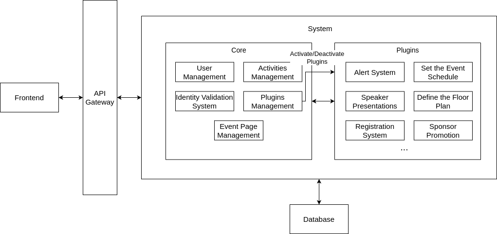

# M1 - Inception

  <iframe loading="lazy" style="position: absolute; width: 100%; height: 100%; top: 0; left: 0; border: none; padding: 0;margin: 0;"
    src="https://www.canva.com/design/DAGfdp2D1Lk/z01AkPxQ_J8-p7WBZJJs-g/view?embed" allowfullscreen="allowfullscreen" allow="fullscreen">
  </iframe>

## Project Overview

Creating a _software to manage coffee breaks in events_.

### Context

[AETTUA](https://www.aettua.pt/) is a non-profit organization associated with [DETI](https://www.ua.pt/pt/deti/) – University of Aveiro, dedicated to organizing events that foster networking and learning opportunities. They identified the need for a modular web-based event and conference management system to enhance their activities. This system aims to streamline event management processes, improve attendee engagement, and provide a customizable platform for various types of events.

As a Tech Partner of [TEDxAveiro](https://www.tedxaveiro.com/), AETTUA plans to test the new application during the event. This collaboration provides a real-world scenario to validate the system's effectiveness and gather valuable feedback for further improvements.

### Problem

Currently, AETTUA relies on manual methods for managing events, such as using Google Forms for workshop registrations. These methods are time-consuming and prone to errors, making it difficult to efficiently manage events and provide a seamless experience for attendees.

From this, the following problems arose:
- **Lack of a modular design**: The current system is not flexible enough to adapt to different event types, making it difficult to cater to diverse requirements.
- **Rigid pricing structure**: The existing pricing model does not accommodate varying budget requirements across events, limiting accessibility for smaller events.
- **Limited aesthetic customization options**: Event organizers do not have total freedom to build the event's image, restricting the ability to create a unique and engaging experience.
- **Inflexible integration of new modules**: The system does not easily support the addition of new modules to meet specific requirements that may arise in particular events, hindering scalability and adaptability.
- **Lack of scalability**: Managing multiple events simultaneously becomes challenging without proper tools. While handling a single event might be manageable, organizing two or three events, or only a big one, in the same month can overwhelm the current system, leading to delays and errors.

Addressing these problems is crucial for developing a more effective event management system that can meet the diverse needs of different events and provide a better experience for both organizers and attendees.

### Expected Results

By implementing this project, we aim to achieve the following key results:

1. **A Comprehensive Website for Event Management**:
The platform will provide a website that allows users to instantiate, monitor, and collect data from each event, ensuring seamless management and data-driven decision-making.

2. **A Mobile App for Event Synchronization**:
A mobile application will be available to reflect all configurations and selections made on the website, ensuring a consistent and accessible experience for users across different devices.

3. **Essential Modules for Event Organization**:
The system will include all the necessary modules to efficiently organize events, such as TEDxAveiro, ensuring flexibility and adaptability to different event types.

4. **Customizable Event Modules**:
Users will have access to a variety of additional modules that allow them to tailor their event to their specific needs, making the platform highly adaptable and scalable.

5. **Comprehensive Documentation for Developers**:
The project will provide detailed and well-structured documentation, enabling developers to extend functionality by creating new modules and customizing the platform according to their requirements.

These results ensure that the platform is flexible, scalable, and user-friendly, making event management more efficient and accessible for organizers, participants, and developers alike.

### High-Level Architecture

We have designed a high-level plugin-oriented architecture to outline the potential interactions within the system. This architecture will likely evolve as the project progresses. As shown in the image, the system consists of a core, which provides the essential functionality needed for it to operate. On top of this core, organizers will have the flexibility to enable or disable plugins based on their specific needs.

## State of the Art

### Selected Projects

  <a href="https://www.cvent.com/" target="_blank" rel="noopener noreferrer" 
    className="flex flex-col items-center p-6 border rounded-lg hover:shadow-lg transition-shadow">
    

      
    

    CVENT
  </a>
  
  <a href="https://www.swapcard.com/" target="_blank" rel="noopener noreferrer"
    className="flex flex-col items-center p-6 border rounded-lg hover:shadow-lg transition-shadow">
    

      
    

    Swapcard
  </a>
  
  <a href="https://whova.com/" target="_blank" rel="noopener noreferrer"
    className="flex flex-col items-center p-6 border rounded-lg hover:shadow-lg transition-shadow">
    

      
    

    Whova
  </a>
  
  <a href="https://bizzabo.com/" target="_blank" rel="noopener noreferrer"
    className="flex flex-col items-center p-6 border rounded-lg hover:shadow-lg transition-shadow">
    

      
    

    Bizzabo
  </a>

### Market Analysis Overview
These are some of the most relevant event management platforms currently available:

- **CVENT**: Enterprise-focused platform with comprehensive features
- **Swapcard**: Modern solution with strong networking capabilities
- **Whova**: User-friendly platform with good community features
- **Bizzabo**: Flexible solution with strong customization options

A detailed feature comparison and analysis can be found in the [Elaboration phase](/elaboration#features-comparison).
